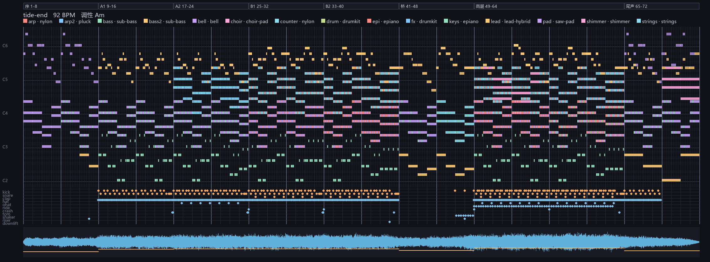

# llm-music-lab


**文本乐谱 → 电子音。** 把一份纯文本乐谱渲染成音频：合成器、效果器、混音链、无损编码器全部自研，不依赖采样库、外部程序或第三方音频库。

工具链的包名叫 **tmskit**（Text Music Score kit）；仓库名 `llm-music-lab` 取的是这类实验的统称 —— **不接音乐模型，让 LLM 从零把「文本 → 声音」这条链路搭出来**。

> [!IMPORTANT]
> **前置条件**
> - **Python 3.11+**
> - 操作系统不限；本机实测 Windows 11
> - 磁盘：源码不到 1 MB；产物另需约 22 MB（无损 FLAC）/ 32 MB（WAV）
>
> **依赖**
> - [`numpy`](https://numpy.org/) 2.x —— 全部数值运算，**必需**
> - [`Pillow`](https://python-pillow.org/) 12.x —— 仅 `tmskit roll`（画钢琴卷帘图）需要，**可选**
>
> **不需要**：ffmpeg / sox / 任何音频库 / 任何采样素材 / 联网。无损压缩用仓库自带的 FLAC 编解码器完成。

产物：**《潮汐尽头》Where the Tide Ends** —— 3 分 12 秒原创器乐电子（A 小调 / 92 BPM / 72 小节 / 15 声部）。乐谱在 [`score/tide-end.tms`](score/tide-end.tms)。

---

## 缘起

最近被最新的 Claude 模型在**动画**上的表现惊艳到了。然后就想到一件事：

**好像没有让 LLM 去「整音乐」的。**

市面上的 AI 音乐基本都是专门的音乐模型——喂音频、出音频，模型本身就是个黑盒乐器。而 LLM 这一路在代码、动画、文档上都已经跑通了，唯独音乐这块，我没怎么见过有人让 LLM 从零把整条链路搭起来。

所以这个仓库其实是一次**对照实验**：不给它任何音乐模型，只给它一个空文件夹和一句话，看它能不能像做动画那样，自己把「文本 → 声音」这条链路从头搭出来，并且真的写出东西。

### 第一轮的提示词

```text
我要测试一下你的纯音乐的水平。
当前文件夹是空文件夹，没有任何的文件。
你需要从零亲自创建一个将你输出的文本转成电子音的工具，并由你创建一个乐谱或者其他的什么文档来让这个工具产生声音。
我要的交付物是一个由你产出的全原创的纯音乐。
我给你所有的权限，你可以亲自去搜索怎么样才能创建一个LLM能维护的看懂的规则，你可以去搜索什么样的音乐才是好音乐。等等你可以去做你认为你需要的任何事。
```

### 运行环境

| 项 | 值 |
|---|---|
| 客户端 | DSH（DeepSeek Harness） |
| 模型 | DeepSeek V4.1 Flash |
| 思考强度 | high |
| 运行时 | Python 3.12.14 + numpy 2.3.5 |
| 机器 | Windows 11 · Ryzen 7 7435H · 16 GB RAM |
| 权限 | 全部权限 |

---

## 出品

- 无损成品：[`out/tide-end.flac`](out/tide-end.flac)（22 MB，任意支持 FLAC 的播放器都能放）
- 浏览器里听：双击 [`out/tide-end.html`](out/tide-end.html)（附带全曲钢琴卷帘图）
- WAV 未入库（32 MB，可由乐谱约 90 秒重新生成）：`python -m tmskit render score/tide-end.tms -o out/tide-end.wav`



### 吐槽一句
> 虽然听着不错，但莫名感觉像丧乐。因为本身不是学艺术的，也不懂怎么改。所以只当成技术探索了。

| 项 | 实测 |
|---|---|
| 整体 RMS / 真峰值 / 削波 | −16.3 dBFS / −1.00 dBTP / 0 样本 |
| 限幅增益衰减 | 2.0 dB |
| 段落动态弧 | 序 −21.3 → 桥 −18.9（谷）→ 高潮 −15.7（峰）→ 尾声 −19.2，单峰极差 5.6 dB |
| 声道相关度 | +0.60（单声道安全） |
| 全曲最高音 | C6，第 53 小节（全曲 72% 处） |
| 乐谱校验 | 0 错误 0 警告 |
| 确定性 | 两次渲染逐字节一致 |
| FLAC | 32.4 MB → 22.1 MB（68.2%），往返逐字节一致 |

---

## 快速开始

```powershell
python -m tmskit check  score/tide-end.tms          # 静态校验（错误必须为 0）
python -m tmskit render score/tide-end.tms -o out/tide-end.wav
python -m tmskit analyze out/tide-end.wav -s score/tide-end.tms
python -m tmskit roll   score/tide-end.tms -w out/tide-end.wav -o out/tide-end-piano-roll.png
python -m tmskit all    score/tide-end.tms -o out   # check + render + analyze + roll
python -m tmskit flac   out/tide-end.wav -o out/tide-end.flac --verify
python -m tmskit patches                            # 列出全部音色与推荐音域
python -m unittest discover -s tests -t .           # 自检
```

## 乐谱长什么样

```
tempo 92
key Am
instrument lead patch=lead-hybrid gain=1.10 pan=-0.06 reverb=0.42

pattern lead.M {
    E5 0 1.5 .92      # 音名 起拍 时值 力度
    A5 1.5 .5 .84
    Am 8 4            # 和弦记号，按 instrument 的 chord= 模式展开
}

pattern drum.drive {
    grid 16           # 每小节 16 格
    kick  X . . . . . X . . . X . . . . .
    snare . . . . X . . . . . . . X . . .
}

arrange
    bars 25-31  pad.chorus, lead.C, bass.chorus, drum.drive
```

完整语法见 [`docs/01-格式规范-tms.md`](docs/01-格式规范-tms.md)。

## 它是怎么工作的

```
score/*.tms ──解析──► Score ──校验──► 分轨缓冲 ──合成──► 效果/混音 ──母带──► WAV / FLAC
                                 （voices/drums 出波形，effects 出处理，render 只调度）
```

- **音色**：13 个有音高音色用「加法合成 + FM」实时算（每个分音独立做时变谱型塑形），12 个鼓件用正弦/噪声 + 包络 + 频域滤波。**没有一个采样**。
- **混音**：合成 IR 卷积混响、乒乓反馈延迟、合唱、侧链闪避、母带 EQ / 胶水压缩 / 前视限幅、120 Hz 以下单声道。
- **确定性**：同一乐谱 + 同一 `seed` → **逐字节相同**的 WAV。
- **自检**：`check` 管语法与乐理（调外音、强拍和弦音、音域、pattern 循环对齐、同轨叠加），`analyze` 管电平与动态，`flac --verify` 管无损编码往返。

细节见 [`docs/05-架构与信号链.md`](docs/05-架构与信号链.md) 与 [`docs/06-关键决策与踩坑记录.md`](docs/06-关键决策与踩坑记录.md)。

## 目录

| 路径 | 内容 |
|---|---|
| `score/tide-end.tms` | 作品本体的乐谱（人/agent 直接读写这个文件） |
| `score/example.tms` | 最小示例乐谱（4 小节，用来快速理解格式） |
| `tmskit/` | 工具链：解析 → 校验 → 合成 → 效果 → 母带 → 分析 → 可视化 → FLAC |
| `tests/` | 24 项自检（乐理、解析、校验、展开、渲染、FLAC 往返） |
| `docs/00-索引.md` | 文档导航与阅读顺序 |
| `docs/01`–`04` | 格式规范 / 音色与混音 / 乐曲设计 / FLAC 导出 |
| `docs/05`–`08` | 架构与信号链 / 决策与踩坑 / 扩展与工作流 / 许可与素材来源 |
| `out/` | 成品：FLAC、钢琴卷帘图、播放页 |
| `reference/` | 作曲前的外部调研笔记（只读资料，不参与构建） |
| `AGENTS.md` | 项目硬约束（给接手的 agent） |

## 许可

| 范围 | 协议 |
|---|---|
| 代码与文档（`tmskit/`、`tests/`、`docs/`、`README.md`、`AGENTS.md`） | [MIT](LICENSE) |
| 音乐作品（`score/`、`out/*.wav`、`out/*.flac`、`out/*.png`） | [CC BY 4.0](LICENSE-MUSIC) |

一句话：**代码随便用（保留版权声明），音乐随便用（署名即可，商用也可以）。**

## 素材来源

全部自产：音色实时合成、混响 IR 程序生成、乐谱原创、图像由代码绘制。**不含任何第三方采样或素材**，也没有 vendored 代码。运行时依赖只有 numpy（BSD-3-Clause）与可选的 Pillow（MIT-CMU），均不影响你选择的协议。

关于 AI 生成内容的版权说明（部分辖区要求「人类作者」）见 [`docs/08-许可与素材来源.md`](docs/08-许可与素材来源.md) §4。
